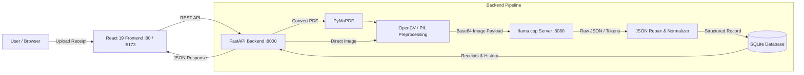

# 🧾 Receipt Tracker

An AI-powered expense tracking and receipt management application that extracts structured data from receipt photos and PDFs using a locally-run, fine-tuned vision-language model. 

Upload a receipt &rarr; preprocess image &rarr; extract company, date, address, and total with **Qwen2-VL** &rarr; analyze spending trends on an interactive dashboard.

---

## ✨ Features

- **Multi-Format Ingestion**: Drag-and-drop support for receipt images (`.png`, `.jpg`, `.jpeg`) and documents (`.pdf` converted automatically via PyMuPDF).
- **Adaptive Image Preprocessing**: OpenCV and Pillow pipeline that analyzes luminosity and contrast, applying automatic contrast correction when necessary.
- **Local Vision AI Inference**: Fine-tuned **Qwen2-VL-2B-Instruct** (quantized GGUF `q4_k_m`) served locally via **llama.cpp server**, communicating through OpenAI-compatible `/v1/chat/completions` API.
- **Robust Output Parsing**: Custom JSON extraction, syntax repair (`repair_json`), and field normalization for dates, currencies, and total amounts.
- **Interactive Dashboard**:
  - **Expense Analytics**: Dynamic charts powered by Recharts with time granularity switching (daily, weekly, monthly, yearly).
  - **KPI Metrics**: Real-time stats on total expenditure, total receipts processed, and average OCR confidence.
  - **Receipt Ledger**: Paginated receipts table with confidence badges, failure indicators, and one-click **Re-upload** to re-scan problematic receipts.
  - **First-Time User Onboarding**: Guided onboarding wizard to walk new users through scanning and monitoring their expenses.
- **Production-Ready Docker Setup**: Full multi-container orchestration via Docker Compose covering the AI inference server, FastAPI backend, and Nginx-served React frontend.

---

## 🏗️ Architecture



---

## 🛠️ Tech Stack

### AI & Vision Pipeline
| Component | Technology | Description |
|---|---|---|
| Vision Model | **Qwen2-VL-2B-Instruct** | Fine-tuned 2B vision-language model for receipt extraction |
| Quantization | **GGUF (`q4_k_m`)** | Efficient 4-bit quantization with `f16` multimodal projector |
| AI Server | **llama.cpp Server** | High-performance C++ inference engine (`ghcr.io/ggml-org/llama.cpp:server`) |
| Preprocessing | **OpenCV & Pillow** | Luminosity & contrast check, automatic contrast adjustment |
| PDF Engine | **PyMuPDF (`fitz`)** | Converts PDF documents into high-resolution images for OCR |

### Backend
| Component | Technology |
|---|---|
| Web Framework | **FastAPI** + **Uvicorn** |
| Database | **SQLite** via standard library & SQLAlchemy helpers |
| Testing & Linting | **pytest**, **httpx**, **ruff** |
| Process & Memory Monitoring | **psutil** (monitors backend & llama-server RAM consumption) |

### Frontend
| Component | Technology |
|---|---|
| Core | **React 19**, **TypeScript**, **Vite** |
| Styling | **Tailwind CSS v4**, **Geist Variable Font** |
| UI Components | **shadcn/ui**, **Radix UI**, **Lucide React** |
| Data Visualization | **Recharts** |
| File Handling | **react-dropzone** |

---

## 📂 Project Structure

```
receipt-tracker/
├── backend/
│   ├── api/
│   │   └── receipts.py          # Upload, re-upload, & list endpoints
│   ├── core/
│   │   ├── config.py            # Global configuration (DB name, model defaults)
│   │   └── database.py          # SQLite database schema, queries & record updates
│   ├── models/
│   │   └── receipt.py           # Pydantic schemas (ReceiptResponse)
│   ├── services/
│   │   ├── image_processing.py  # OpenCV & Pillow contrast/luminosity pipeline
│   │   ├── json_format.py       # JSON extraction, repair & field normalization
│   │   └── ocr.py               # llama-server API client & RAM monitoring
│   ├── tests/
│   │   └── test_main.py         # FastAPI endpoint sanity tests
│   ├── Dockerfile               # Backend container definition
│   ├── main.py                  # FastAPI application entrypoint & CORS config
│   └── requirements.txt         # Python dependencies
├── frontend/
│   ├── src/
│   │   ├── components/
│   │   │   ├── ConfidenceBadge.tsx      # Visual indicator for extraction confidence
│   │   │   ├── ExpenseChart.tsx         # Recharts expense trend visualization
│   │   │   ├── FileUpload.tsx           # Drag-and-drop upload zone
│   │   │   ├── OnboardingWizard.tsx     # Step-by-step onboarding walkthrough
│   │   │   ├── ReceiptTable.tsx         # Paginated receipt history & re-upload action
│   │   │   └── TimeGranularityToggle.tsx# Toggle granularity (day/week/month/year)
│   │   ├── hooks/
│   │   │   ├── useOnboarding.ts         # Onboarding state management
│   │   │   ├── useReceipts.ts           # Receipt fetching & refresh hook
│   │   │   └── useUpload.ts             # File upload state hook
│   │   ├── lib/
│   │   │   └── api.ts                   # Typed API client functions
│   │   ├── App.tsx                      # Dashboard root view
│   │   ├── index.css                    # Tailwind CSS v4 styling rules
│   │   └── main.tsx                     # React DOM entrypoint
│   ├── Dockerfile                       # Multi-stage build (Node 22 + Nginx Alpine)
│   └── package.json                     # Frontend scripts & dependencies
├── models/                              # GGUF models mounted into llama.cpp
│   ├── mmproj_qwen2_model_receipt_f16.gguf
│   └── qwen2_model_receipt_q4_k_m.gguf
├── data/
│   └── receipts/                        # Saved receipt images (runtime storage)
├── docker-compose.yml                   # 3-tier container orchestration
├── package.json                         # Workspace convenience scripts (pnpm)
├── pyproject.toml                       # Python package configuration & Ruff settings
├── receipts.db                          # SQLite database
└── readme.md                            # Documentation
```

---

## 🚀 Getting Started

### Prerequisites

- **Docker & Docker Compose** (Recommended approach)
- *Or for local manual execution:*
  - **Python 3.11+**
  - **Node.js 18+** & **pnpm**
  - GGUF weights placed in `./models`:
    - `qwen2_model_receipt_q4_k_m.gguf`
    - `mmproj_qwen2_model_receipt_f16.gguf`

---

### Option A — Run with Docker Compose (Recommended)

The easiest way to start the complete stack (AI Server + Backend + Frontend):

1. **Clone the repository:**
   ```bash
   git clone <repo-url>
   cd receipt-tracker
   ```

2. **Ensure model files exist:**
   Place your fine-tuned GGUF model files in the `./models/` directory:
   - `models/qwen2_model_receipt_q4_k_m.gguf`
   - `models/mmproj_qwen2_model_receipt_f16.gguf`

3. **Start all containers:**
   ```bash
   docker compose up --build
   ```

4. **Access the application:**
   - 🌐 **Frontend**: `http://localhost` (Port 80)
   - 🔌 **Backend API**: `http://localhost:8000`
   - 📖 **Interactive Swagger Docs**: `http://localhost:8000/docs`
   - 🦙 **Llama Server**: `http://localhost:8080`

---

### Option B — Run Locally (Development Mode)

If you prefer to run services manually for debugging or active development:

#### 1. Start the llama.cpp server
Run the official llama.cpp server pointing to your model:
```bash
docker run -p 8080:8080 -v ./models:/models ghcr.io/ggml-org/llama.cpp:server \
  -m /models/qwen2_model_receipt_q4_k_m.gguf \
  --mmproj /models/mmproj_qwen2_model_receipt_f16.gguf \
  --port 8080 \
  --ctx-size 4048 \
  --no-warmup \
  -ngl 0 \
  --host 0.0.0.0
```
*(If you have a compiled `llama-server` binary with CUDA/Metal support on your host machine, you can run it directly with `-ngl 33` for GPU acceleration).*

#### 2. Start the FastAPI Backend
```bash
# In the project root:
python -m venv .venv
# Windows:
.venv\Scripts\activate
# Linux/macOS:
source .venv/bin/activate

pip install -r backend/requirements.txt

# Specify the local llama server URL if running on localhost:
export LLAMA_SERVER_URL="http://localhost:8080/v1/chat/completions" # or $env:LLAMA_SERVER_URL in PowerShell

# Run with hot reload:
pnpm backend
# or: uvicorn backend.main:app --reload --port 8000
```

#### 3. Start the React Frontend
```bash
# In another terminal:
pnpm install
pnpm frontend
# or: cd frontend && pnpm dev
```
The frontend dev server will be accessible at `http://localhost:5173`.

---

## 📡 API Reference

| Method | Path | Description | Payload / Parameters |
|---|---|---|---|
| `GET` | `/health` | Service health status | None |
| `GET` | `/` | Root greeting | None |
| `POST` | `/api/uploadReceipt` | Upload receipt (PNG, JPG, PDF) & trigger OCR | `multipart/form-data` (`file`) |
| `GET` | `/api/receipts` | Retrieve all parsed receipts (ordered by latest) | None |
| `POST` | `/api/receipts/{receipt_id}/reupload` | Re-upload image to re-parse a failed or corrected receipt | `multipart/form-data` (`file`) |

### Example Upload Response:
```json
{
  "receipt_id": "9b1deb4d-3b7d-4bad-9bdd-2b0d7b3dcb6d",
  "status": "parsed",
  "filename": "9b1deb4d-3b7d-4bad-9bdd-2b0d7b3dcb6d.jpg",
  "datetime": "2026-09-29T17:20:00.000Z",
  "company": "Supermarché Express",
  "date": "2026-09-15",
  "total": 42.50,
  "address": "123 Rue de Paris, 75001 Paris",
  "confidence": 1.0,
  "processing_time": 4.12
}
```

---

## 🔬 Model Details & Benchmarking

The OCR pipeline was evaluated extensively between **SmolVLM-256M** and **Qwen2-VL-2B-Instruct** to achieve high accuracy on complex, unstandardized receipts.
=======
The OCR pipeline has transitioned to **Qwen2-VL-2B** for production due to superior accuracy and reliability.
- **Model**: Qwen2-VL-2B-Instruct — a 2B parameter vision-language model
- **Training Data**: Fine-tuned on 950 receipts using the [Receipt Dataset SSD300 v2](https://www.kaggle.com/datasets/dhiaznaidi/receiptdatasetssd300v2) from Kaggle.
- **Inference**: Run locally using `llama.cpp` and GGUF format for optimized execution.
- **Model finetuned huggiging face link**: https://huggingface.co/gueye07/Qwen-Receipt-FineTuned
- **Decision**: Selected over SmolVLM-256M due to a significantly higher F1 score (0.97 vs 0.61) and robust performance on unseen layouts.

- **Model**: Qwen2-VL-2B-Instruct (2-billion parameter vision-language model)
- **Dataset**: Fine-tuned on 950 receipts using the [Receipt Dataset SSD300 v2](https://www.kaggle.com/datasets/dhiaznaidi/receiptdatasetssd300v2) from Kaggle.
- **Inference Runtime**: Quantized 4-bit GGUF via `llama.cpp` using an OpenAI-compatible completion API.

### Cloud Training Evaluation (Google Colab)

| Model | Stage | Reliability (F1) | Format (JSON Failure) | Accuracy (CER) |
|---|---|---|---|---|
| **SmolVLM-256M** | Pre-FT | ❌ 0% | ❌ 100% | ❌ 2.99 |
| **SmolVLM-256M** | Post-FT | ⚠️ 61% | ✅ 0% | ✅ 0.54 |
| **Qwen2-VL-2B** | Pre-FT | ✅ 86% | ✅ 0% | ⚠️ 1.15 |
| **Qwen2-VL-2B** | Post-FT | 🎯 **97%** | ✅ **0%** | ⚠️ 1.04 |

> **Key Finding**: While fine-tuning made SmolVLM functional, it suffered from hallucinated numbers and price confusion (e.g. confusing timestamps or individual item prices for the grand total). Qwen2-VL-2B achieved near-perfect entity extraction (0.97 F1) with 100% valid JSON generation.

### Local Inference Findings (llama.cpp)

| Metric / Aspect | Qwen2-VL-2B-Instruct | SmolVLM-256M |
|---|---|---|
| **Reliability & Accuracy** | Correctly extracted all fields; zero critical hallucinations | Hallucinated totals, merged words, repeated strings |
| **Visual Analysis Latency** | ~2.8 minutes (CPU) / Seconds (GPU) | ~2.6 seconds |
| **Generation Latency** | ~6.8 seconds | ~1.5 seconds |
| **Context Fit** | `truncated = 0` (entire image & prompt preserved) | `truncated = 0` |
| **Verdict** | **Selected for Production** | Inadequate accuracy for financial data |

---

## 🧪 Testing & Code Quality

Run tests and linter across the backend:

```bash
# Run backend test suite
pytest backend/tests

# Check formatting and linting
ruff check backend
```

Run frontend sanity tests:
```bash
cd frontend && pnpm test
```

---

## 📋 Roadmap & Known Limitations

- [x] Adaptive image contrast & luminosity preprocessing
- [x] Local GGUF vision inference via `llama.cpp` server
- [x] Multi-container Docker Compose configuration
- [x] Re-upload flow for failed or low-confidence receipts
- [x] User onboarding wizard
- [ ] GPU-accelerated Docker profile (`--gpus all` / CUDA image) for faster inference
- [ ] In-table inline editing for manual correction of parsed fields
- [ ] Multi-page PDF extraction support (currently processes first page)
- [ ] Export receipt history to CSV / Excel

---

## 📄 License
=======


